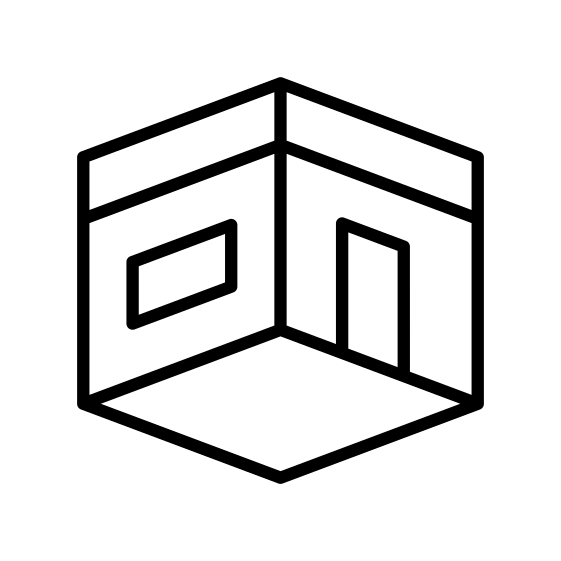

<!-- PROJECT LOGO -->
<br />
<div align="center">
  <a href="https://github.com/GlintonLiao/questopia">
    
  </a>

  <h3 align="center">Questopia</h3>

  <p align="center">
    3D Room · Online Portfolio · Personal Website
    <br />
    <a href="https://questopia.vercel.app/">View Live</a>

  </p>
</div>

<!-- ABOUT THE PROJECT -->
## About The Project

After working as an architect for two years, I decided to switch my career path to become a software engineer. Questopia is the 3D visualization of my room, and it's also my online portfolio, mainly consist of two parts of projects: 

1. My current projects as a programmer(2022-present, still under construction...)
2. My previous projects as an architectural designer(2018-2021)

Visit the [website](https://questopia.vercel.app/) to discover more!

## Tech Stacks

+ HTML & CSS
+ TypeScript
+ Three.js
  + GLSL/Shader
  + Blender
  + Tweakpane
  + normalize-wheel
+ Vite
  + plugin-glsl
+ Vercel
  
### Reference

If you want to build your own projects using same settings as mine, you can reference to [threejs-template-typescript](https://github.com/GlintonLiao/threejs-template-typescript), click "Use this template".

## Key Concepts

### Modeling

+ #### Performance Enhancement
  
  Because I set the navigation limits, there are some faces couldn't be seen, such as the back side of the books, the bottom of the bed, and the bottom sides of every objects on the table.
  
  
  
  After deleting the redundant faces, plus some overlapping faces, **the model size went from 18 MB to 3 MB, which improved by 88%**
  
+ #### Texture Map

  There is no dynamic light or any ray tracing in the scene, all colors and shadow are pre-rendered, as known as "Baked". Baking is an important technique for performance, and it also let us to achieve some fancy effect, such as mixing day and night.
  
  
  
  Get the baked texture maps, and we can load it using three.js
  
+ #### Export

  Click "Export" > `.glb/.gltf` file in Blender, and some key settings:
  
  ```
  Material: no export
  FlipY: √
  Geometry:
    UVs: √
  Compression: √(uncheck if there is any problem)
  ```

### Structures

+ #### Experience

  The core structure of the project.
  
  `Experience.ts` is a singleton instance, and we load every other parts on this instance.
  
  ```typescript
  // Experience.ts
  constructor(_options?: OptionProps) {
      if (Experience.instance) {
          return Experience.instance
      } else {
          Experience.instance = this
      }

      // Options
      this.targetElement = _options?.targetElement

      if (!this.targetElement) {
          console.warn("Missing 'targetElement' property")
          return
      }

      this.time = new Time()
      this.sizes = new Sizes()

      this.setConfig()
      this.setDebug()
      this.setScene()
      this.setCamera()
      this.setRenderer()
      this.setResources()
      this.setWorld()
      this.setNavigation()

      this.sizes.on("resize", () => {
          this.resize()
      })

      this.update()
  }
  ```

+ #### World

  The place holding models, we load models on this instance.
  
  ```typescript
  // World.ts
  constructor(_options?: any) {
      this.experience = new Experience()
      this.config = this.experience.config
      this.scene = this.experience.scene
      this.resources = this.experience.resources

      this.resources.on("groupEnd", (_group) => {
          if (_group.name === "base") {
              this.setBaked()
              this.setTitle()
              this.setArchiModel()
              this.setScreens()
              this.setImages()
              this.setChair()
              this.setCoffee()
              this.setRaycaster()
          }
      })
  }
  ```

+ #### Components

  Inside each component, we load the mesh and texture, create material for each child of the model, and finally add it to the scene.
  
  Remember to set the `flipY` and `encoding` attributes for the texture.
  
  ```typescript
  // Images.ts
  setModel(): void {
      this.model = {}

      // Texture
      this.model.texture = this.resources.items.imagesDayTexture
      this.model.texture.flipY = false
      this.model.texture.encoding = THREE.sRGBEncoding
      // Material
      this.model.material = new THREE.MeshBasicMaterial({
          map: this.model.texture,
      })

      // Mesh
      this.model.mesh = this.resources.items.imagesModel.scene
      this.model.mesh.material = this.model.material

      this.model.mesh.traverse((_child: THREE.Object3D) => {
          if (_child instanceof THREE.Mesh) {
              _child.material = this.model.material
          }
      })

      this.scene.add(this.model.mesh)
  }
  ```

### Shader Material

To use shader material, we need to define two files: `vertex.glsl`, `fragment.glsl`.

We can pass arguments in ts file, and by pointing at target shader, the shader file can receive the value we pass.

```typescript
// Baked.ts
this.room.material = new THREE.ShaderMaterial({
    uniforms: {
        uBakedDayTexture: { value: this.room.bakedDayTexture },
        uBakedNightTexture: { value: this.room.bakedNightTexture },
        uLightMapTexture: { value: this.room.lightMapTexture },

        uNightMix: { value: 0 },

        uLightScreenColor: {
            value: new THREE.Color(this.colors.Screen),
        },
        uLightScreenStrength: { value: 1.5 },

        uLightLampColor: { value: new THREE.Color(this.colors.Lamp) },
        uLightLampStrength: { value: 1.6 },

        uLightShelfColor: { value: new THREE.Color(this.colors.Shelf) },
        uLightShelfStrength: { value: 1.0 },
    },
    vertexShader: vertexShader,
    fragmentShader: fragmentShader,
})
```

and we can receive these arguments in shader file:

```glsl
// baked/fragment.glsl
uniform sampler2D uBakedDayTexture;
uniform sampler2D uBakedNightTexture;
uniform sampler2D uLightMapTexture;

uniform float uNightMix;

uniform vec3 uLightScreenColor;
uniform float uLightScreenStrength;

uniform vec3 uLightLampColor;
uniform float uLightLampStrength;

uniform vec3 uLightShelfColor;
uniform float uLightShelfStrength;

varying vec2 vUv;

void main()
{
    vec3 bakedDayColor = texture2D(uBakedDayTexture, vUv).rgb;
    vec3 bakedNightColor = texture2D(uBakedNightTexture, vUv).rgb;
    vec3 bakedColor = mix(bakedDayColor, bakedNightColor, uNightMix);
    vec3 lightMapColor = texture2D(uLightMapTexture, vUv).rgb;
    ...
    gl_FragColor = vec4(bakedColor, 1.0);
}
```

### Raycaster

To check if the mouse is hovering some elements, we can set a ray caster:

```typescript
this.raycaster.setFromCamera(
    this.pointer,
    this.experience.camera.instance
)
const intersects = this.raycaster.intersectObjects(this.objs)
```

## Run on Your Local Machine

First, clone the project source code from your terminal:

```bash
git clone git@github.com:GlintonLiao/questopia.git
cd questopia
```

Second, install the dependencies and run on your local server:

```sh
pnpm install
pnpm run dev
```

Open [http://localhost:5173](http://localhost:5173) with your browser to see the result.

You can start editing the page by modifying `main.ts`. The page auto-updates as you edit the file.
