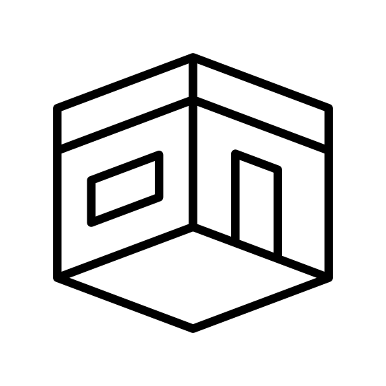

<!-- PROJECT LOGO -->
<br />
<div align="center">
  <a href="https://github.com/GlintonLiao/questopia">
    
  </a>

  <h3 align="center">Questopia</h3>

  <p align="center">
    3D Room · Online Portfolio · Personal Website
    <br />
    <a href="https://questopia.vercel.app/">View Live</a>
  </p>
</div>

## About The Project

After working as an architect for two years, I decided to switch my career path to become a software engineer. Questopia is a 3D visualization of my room and an online portfolio for two groups of work:

1. Current projects as a programmer, from 2022 to the present
2. Previous projects as an architectural designer, from 2018 to 2021

Visit the [website](https://questopia.vercel.app/) to discover more.

## Tech Stack

- React
- TypeScript
- Three.js
- React Three Fiber
- Drei
- GLSL shaders
- Blender
- Leva
- Vite
- vite-plugin-glsl
- Vercel

## Features

- Interactive 3D room built with React Three Fiber
- Baked day and night room textures mixed through a custom shader
- Smooth orbit, pan, and zoom camera controls
- Clickable 3D screens and images that open portfolio overlays
- Project data separated from the UI in `src/data/projects.ts`
- Loading progress screen powered by Drei asset loading state
- Draco and Basis assets served from `public/`

## Project Structure

```txt
src/
  App.tsx                         # App state, loading screen, overlays
  components/
    Experience.tsx                # R3F Canvas and 3D scene composition
    CameraRig.tsx                 # Custom camera orbit, pan, and zoom controls
    Room.tsx                      # Main baked room model and shader material
    Screens.tsx                   # Interactive current-project screens
    Images.tsx                    # Interactive previous-project image wall
    InteractionRaycaster.tsx      # Mesh-name based click fallback
    Overlay.tsx                   # Project grid overlay
    LoadingScreen.tsx             # Loading progress UI
  data/
    projects.ts                   # Current and previous portfolio projects
  shaders/
    baked/                        # Room shader
    coffeeSteam/                  # Coffee steam shader
public/
  assets/                         # GLB models and baked textures
  imgs/                           # Project covers and contact images
  draco/                          # Draco decoder assets
  basis/                          # Basis transcoder assets
```

## Architecture

The project was refactored from a custom Three.js singleton architecture to a React component architecture powered by React Three Fiber.

`App.tsx` owns the application state that sits outside the WebGL scene: overlay visibility, loading progress, and loading completion. The 3D experience reports loading progress through callbacks, and the overlay is rendered as normal React UI on top of the canvas.

```tsx
<Suspense fallback={null}>
  <Experience
    onOpenOverlay={handleOpenOverlay}
    onProgress={handleProgress}
    onReady={handleReady}
  />
</Suspense>
<LoadingScreen progress={progress} ready={ready} />
<Overlay kind={overlayOpen} onClose={handleCloseOverlay} />
```

`Experience.tsx` owns the `<Canvas />` and composes the scene from small components. Models, shaders, camera behavior, click handling, and UI labels are now isolated by responsibility.

```tsx
<Canvas
  camera={{ fov: 25, near: 0.1, far: 150, position: [0, 0, 5] }}
  gl={{ antialias: true, outputColorSpace: 'srgb' }}
  dpr={[1, dpr]}
  frameloop="always"
>
  <CameraRig />
  <Room />
  <Title />
  <ArchiModels />
  <Screens onOpenOverlay={onOpenOverlay} />
  <Images onOpenOverlay={onOpenOverlay} />
  <InteractionRaycaster onOpenOverlay={onOpenOverlay} />
  <RotatingChair />
  <CoffeeSteam />
  <InteractiveObjects />
  <HoverLabels />
  <Preload all />
</Canvas>
```

## Key Concepts

### Modeling

#### Performance Enhancement

The camera movement is limited, so some faces can never be seen, including the back side of books, the bottom of the bed, and the bottom side of objects on the table.


After deleting redundant and overlapping faces, the model size went from 18 MB to 3 MB, an 88% reduction.

#### Texture Map

There is no dynamic lighting or ray tracing in the room. Most colors and shadows are pre-rendered as baked textures. This keeps the scene lightweight and also makes it possible to mix day and night states through shader uniforms.


#### Export

In Blender, export the scene as a `.glb` or `.gltf` file. Important settings:

```txt
Material: no export
FlipY: enabled
Geometry:
  UVs: enabled
Compression: enabled, unless it causes loading issues
```

### Loading Models and Textures

Models and textures are loaded with Drei hooks. Each component is responsible for its own GLB, texture, material, and scene clone.

```tsx
const { scene } = useGLTF('/assets/imagesModel.glb')
const texture = useTexture('/assets/imagesDayTexture.jpg')

texture.flipY = false
texture.colorSpace = THREE.SRGBColorSpace

const material = useMemo(
  () => new THREE.MeshBasicMaterial({ map: texture }),
  [texture],
)

const clonedScene = useMemo(() => {
  const cloned = scene.clone(true)
  cloned.traverse((child) => {
    if (child instanceof THREE.Mesh) {
      child.material = material
    }
  })
  return cloned
}, [scene, material])
```

### Shader Material

The room uses a custom shader to mix baked day and night textures, then add light-map based screen, lamp, and shelf colors.

```tsx
const material = new THREE.ShaderMaterial({
  uniforms: {
    uBakedDayTexture: { value: bakedDayTexture },
    uBakedNightTexture: { value: bakedNightTexture },
    uLightMapTexture: { value: lightMapTexture },
    uNightMix: { value: debugValues.nightMix },
    uLightScreenColor: { value: new THREE.Color(debugValues.screenColor) },
    uLightScreenStrength: { value: debugValues.screenStrength },
    uLightLampColor: { value: new THREE.Color(debugValues.lampColor) },
    uLightLampStrength: { value: debugValues.lampStrength },
    uLightShelfColor: { value: new THREE.Color(debugValues.shelfColor) },
    uLightShelfStrength: { value: debugValues.shelfStrength },
  },
  vertexShader,
  fragmentShader,
})
```

The shader receives those uniforms in `src/shaders/baked/fragment.glsl`.

```glsl
uniform sampler2D uBakedDayTexture;
uniform sampler2D uBakedNightTexture;
uniform sampler2D uLightMapTexture;

uniform float uNightMix;

uniform vec3 uLightScreenColor;
uniform float uLightScreenStrength;

uniform vec3 uLightLampColor;
uniform float uLightLampStrength;

uniform vec3 uLightShelfColor;
uniform float uLightShelfStrength;

varying vec2 vUv;

// blendLighten helper omitted for brevity.
void main()
{
    vec3 bakedDayColor = texture2D(uBakedDayTexture, vUv).rgb;
    vec3 bakedNightColor = texture2D(uBakedNightTexture, vUv).rgb;
    vec3 bakedColor = mix(bakedDayColor, bakedNightColor, uNightMix);
    vec3 lightMapColor = texture2D(uLightMapTexture, vUv).rgb;

    float lightScreenStrength = lightMapColor.r * uLightScreenStrength;
    bakedColor = blendLighten(bakedColor, uLightScreenColor, lightScreenStrength);

    float lightShelfStrength = lightMapColor.b * uLightShelfStrength;
    bakedColor = blendLighten(bakedColor, uLightShelfColor, lightShelfStrength);

    float lightLampStrength = lightMapColor.g * uLightLampStrength;
    bakedColor = blendLighten(bakedColor, uLightLampColor, lightLampStrength);

    gl_FragColor = vec4(bakedColor, 1.0);
}
```

### Interaction

The primary click behavior is attached to the relevant R3F primitives in `Screens.tsx` and `Images.tsx`. `InteractionRaycaster.tsx` also keeps a mesh-name based raycaster fallback for cases where a cloned GLB mesh needs explicit hit testing.

```tsx
const raycaster = new THREE.Raycaster()
raycaster.setFromCamera(pointer, camera)

const [hit] = raycaster.intersectObjects(targets, false)
if (hit && SCREEN_MESH_NAMES.has(hit.object.name)) {
  onOpenOverlay('current')
}
```

### Camera

`CameraRig.tsx` implements custom camera controls instead of using OrbitControls. It supports:

- Drag to rotate
- Shift, Ctrl, middle mouse, or right mouse drag to pan
- Wheel to zoom
- Touch drag and two-finger alternative movement
- Clamped camera radius, angle, and target position
- Smoothed movement in `useFrame`

## Run Locally

Clone the project:

```bash
git clone git@github.com:GlintonLiao/questopia.git
cd questopia
```

Install dependencies:

```bash
npm install
```

Start the development server:

```bash
npm run dev
```

Open [http://localhost:5173](http://localhost:5173) in your browser.

Build for production:

```bash
npm run build
```

Preview the production build:

```bash
npm run preview
```

## Reference

If you want to build your own Three.js project with a similar TypeScript and Vite setup, you can reference [threejs-template-typescript](https://github.com/GlintonLiao/threejs-template-typescript).
